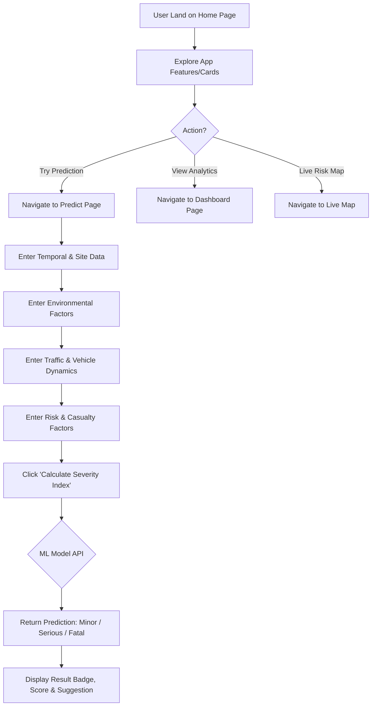
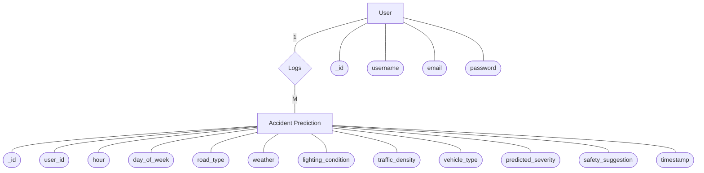
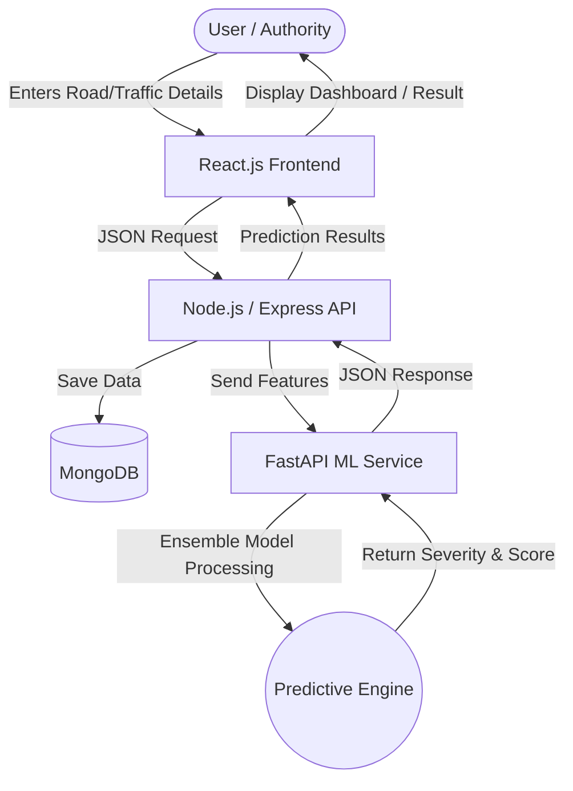
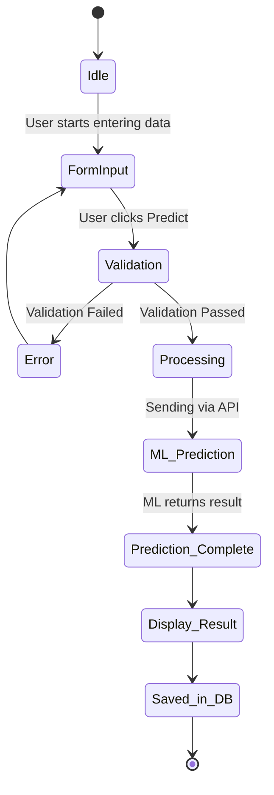
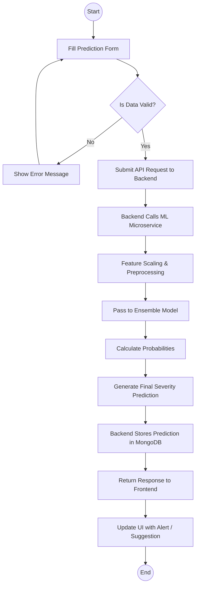
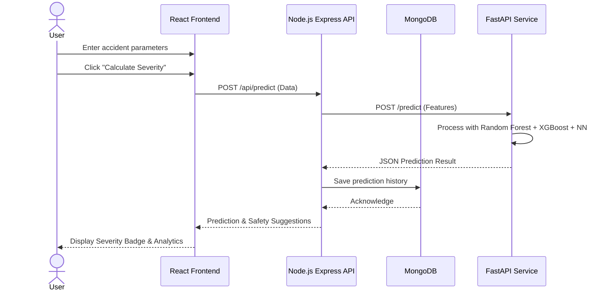

# 🚗 Road Accident Severity Prediction
### AI/ML + MERN Stack | B.E. Final Year Project

<div align="center">


**Predict road accident severity (Minor / Serious / Fatal) with an ensemble ML model achieving 88–92% accuracy.**

</div>

---

## 📋 Table of Contents
1. [Project Overview](#-project-overview)
2. [Objectives](#-objectives)
3. [What Will the Project Do?](#-what-will-the-project-do)
4. [System Architecture](#-system-architecture)
5. [High-Level Working Layers](#-high-level-working-layers)
6. [Tech Stack](#-tech-stack)
7. [Dataset](#-dataset)
8. [ML Models & Algorithms](#-ml-models--algorithms)
9. [Model Performance](#-model-performance)
10. [Accident Factors Analyzed](#-accident-factors-analyzed)
11. [Project Structure](#-project-structure)
12. [Installation & Setup](#-installation--setup)
13. [ML Pipeline Usage](#-ml-pipeline-usage)
14. [API Reference](#-api-reference)
15. [Frontend Pages](#-frontend-pages)
16. [Environment Variables](#-environment-variables)
17. [Deployment](#-deployment)
18. [Contributing](#-contributing)
19. [License](#-license)
20. [Recent Updates & Bug Fixes](#-recent-updates--bug-fixes)

---

## 🔍 Project Overview

**Title:** Road Accident Severity Prediction using AI/ML & MERN Stack

Road Accident Severity Prediction is a **Machine Learning–based system** designed to analyze historical road accident data and predict the severity level of accidents — **(Minor, Serious, or Fatal)**. The system helps **traffic authorities, emergency services, and government agencies** take preventive measures by identifying high-risk conditions and accident-prone scenarios.

The system uses **historical accident datasets** to train a Machine Learning model. The prediction can be used by:
- 🚦 **Smart traffic systems** to adapt signal timing and speed limits
- 🏛️ **Government agencies** to plan infrastructure improvements
- 🏥 **Emergency services** to pre-position ambulances in high-risk zones
- 🚗 **Insurance companies** to assess risk and plan preventive measures

---

## 🎯 Objectives

To predict the **severity level** of a road accident (Minor, Serious, or Fatal) based on various factors such as:

| Factor Category | Input Variables |
|----------------|----------------|
| 🌧️ **Road Conditions** | Wet, dry, icy, under construction, flooded |
| ⛅ **Weather Conditions** | Rainy, sunny, foggy, snowy, windy |
| 🚙 **Vehicle Information** | Type, age, speed at time of accident, safety features |
| ⏰ **Time Factors** | Day/night, rush hour, weekend/weekday, season |
| 📍 **Location Data** | Urban/rural, highway, city center, junction type |
| 🚦 **Traffic Data** | Traffic density, signal type, number of lanes |

----

## 🔧 What Will the Project Do?

### Input
User or system feeds details of road, weather, vehicle, and time factors into the web interface.

### Processing
1. The ML model (trained on past accident data) processes the inputs.
2. An ensemble of Random Forest + XGBoost + Neural Network predicts the accident severity category:

| Category | Description |
|----------|-------------|
| 🟡 **Minor Injury** | Property damage or minor bodily harm |
| 🟠 **Serious Injury** | Hospitalization required, significant harm |
| 🔴 **Fatal Accident** | One or more fatalities |

### Output
- ✅ Displays the **predicted severity** with confidence score
- 💡 **Suggests safety measures** (e.g., *"Reduce speed — icy road conditions at night detected"*)
- 📊 Shows feature importance and contributing factors

### Frontend (MERN — React.js Dashboard)
- Authorities can enter accident-related info via a **multi-step form**
- View **predictions & analytics graphs** in real-time
- **Professional UI**: Clean, enterprise-grade light blue and white theme for a modern aesthetic.
- Result displayed dynamically with safety suggestions based on assessed risk factors.
- **Live Pune Map**: Track accident risks in real-time across Pune with professional alert sounds.

### Backend (Node.js + Express)
- Handles API calls between the React frontend and Python ML model
- Stores prediction history in MongoDB for retraining

### ML Model (Python / scikit-learn / TensorFlow)
- Trained on real-world dataset to make predictions
- Exposed as a **FastAPI** microservice

---

## 🌍 Real-Time Live Telemetry (Live Mode)

The project includes an advanced **Live Tracking & Telemetry Map** functionality that demonstrates real-world application of the AI engine across city infrastructure.

### 1. Asynchronous Background Polling
- Actively scans specific city zones (e.g., areas in Pune) incrementally every 2.5 seconds.
- Fetches live environmental/traffic data and immediately processes them through the Ensemble AI model to recalculate the accident severity risk.

### 2. High-Risk Zone Identification
- City zones predicting "Serious" or "Fatal" risk patterns (with overall crash probability over 80%) are instantly flagged as **Very High Risk Zones**.
- The interactive map updates dynamically, applying visual hazard markers for identified hotspots.

### 3. Automated Audio & Visual Alerts
- Triggers professional-grade audio siren/alerts when a severe new risk zone is identified by the neural network.
- Dashboard pop-ups keep authorities updated with live telemetry feeds.

### 4. OpenStreetMap Geocoding & Autofill
- Direct OpenStreetMap API integration allows users to search for specific locations (like 'Kharadi').
- The system bounds those vectors with OpenMeteo APIs to auto-populate exact live environmental features (weather, temperature, road surface condition) without manual data entry.

---

## 🏗️ System Architecture

```
┌─────────────────────────────────────────────────────────────────┐
│                        USER BROWSER                             │
│              React.js Dashboard (Port 5173)                     │
└────────────────────────────┬────────────────────────────────────┘
                             │ HTTP REST
                             ▼
┌─────────────────────────────────────────────────────────────────┐
│                 Node.js + Express Backend                        │
│                      (Port 5000)                                │
│   Routes: /api/predict  /api/history  /api/analytics           │
└──────────────┬──────────────────────────────┬───────────────────┘
               │ Mongoose ORM                  │ HTTP Proxy
               ▼                               ▼
┌──────────────────────────┐   ┌──────────────────────────────────┐
│      MongoDB Database    │   │    Python FastAPI ML Service     │
│  (Stores accident data   │   │         (Port 5001)              │
│   & prediction history)  │   │  Random Forest + XGBoost + NN   │
└──────────────────────────┘   │  Ensemble Voting Classifier      │
                               │  Accuracy: 88–92%               │
                               └──────────────────────────────────┘
```

---

## 📐 Project Diagrams

### 1. User Flow Diagram
Describes the user's journey through the application, from accessing the home page to obtaining predictions.



### 2. Entity Relationship (ER) Diagram
Shows the database structure using Chen's notation (Entities as rectangles, Attributes as ovals, Relationships as diamonds).



### 3. Data Flow Diagram (DFD)
Illustrates how data moves from the user interface through the backend, to the ML service and database.



### 4. State Diagram
Represents the various states a prediction request goes through during processing.



### 5. Activity Diagram
Details the step-by-step conditional flow of the system's prediction feature.



### 6. Sequence Diagram
Visualizes the time-ordered sequence of interactions between the components.



---

## 🔬 High-Level Working (Three Layers)

### a) Data Collection Layer
- **Source**: Real Chicago Traffic Crashes Dataset (data.cityofchicago.org)
- **Records**: ~800,000+ real-world accidents (updated daily)
- **Fields**: Weather, road condition, vehicle type, speed, time of day, location, severity label
- Pre-processed and cleaned to handle missing values and class imbalance

### b) Prediction Layer (AI/ML)
- Train a **classification model** (Random Forest, XGBoost, Neural Network)
- **Input**: New accident data → **Output**: Severity category (Minor / Serious / Fatal)
- SMOTE oversampling used for class imbalance correction

### c) Application Layer (MERN)
- **Frontend**: React.js dashboard for data entry & results visualization
- **Backend**: Node.js API connecting frontend to ML model
- **Database**: MongoDB stores data for future analysis & model retraining

---

## 💻 Tech Stack

| Layer | Technology | Purpose |
|-------|-----------|---------|
| **ML Framework** | scikit-learn 1.3+ | Random Forest, preprocessing |
| **Boosting** | XGBoost 2.0+ | Gradient boosted trees |
| **Deep Learning** | TensorFlow/Keras 2.x | Neural Network model |
| **ML API** | FastAPI + Uvicorn | Expose model as REST service |
| **Data Processing** | pandas, numpy | Data manipulation |
| **Visualization** | matplotlib, seaborn, plotly | Model evaluation plots |
| **Imbalance Handling** | imbalanced-learn (SMOTE) | Oversample minority class |
| **Backend** | Node.js 18 + Express.js | REST API server |
| **Database** | MongoDB + Mongoose | Data persistence |
| **Frontend** | React 18 + Vite | UI framework |
| **Charts** | Chart.js / Recharts | Analytics visualization |
| **Styling** | CSS3 + custom design | Professional light blue and white theme |

---

## 📊 Dataset

### Primary: Real Chicago Traffic Crashes Dataset
- **Source**: [City of Chicago Data Portal](https://data.cityofchicago.org/api/views/85ca-t3if/rows.csv?accessType=DOWNLOAD)
- **Records**: ~800,000+ real-world accidents (constantly updated)
- **Features**: Highly detailed columns including weather, road conditions, vehicle type, casualties, and speed limits.
- **Why we use this**: Represents true, chaotic city traffic patterns for robust ML prediction, avoiding synthetic data limits.

### Dataset Features Used

| Feature | Type | Values |
|---------|------|--------|
| `Weather_Conditions` | Categorical | Fine, Rain, Snow, Fog, Wind, Other |
| `Road_Surface_Conditions` | Categorical | Dry, Wet, Snow/Ice, Flood, Oil |
| `Light_Conditions` | Categorical | Daylight, Dark-lit, Dark-unlit, Dusk/Dawn |
| `Road_Type` | Categorical | Single, Dual, Roundabout, One-way, Slip road |
| `Vehicle_Type` | Categorical | Car, HGV, Motorcycle, Bus, Bicycle, Van |
| `Speed_Limit` | Numerical | 20–70 mph |
| `Number_of_Casualties` | Numerical | 1–N |
| `Day_of_Week` | Ordinal | 1–7 |
| `Hour_of_Day` | Numerical | 0–23 |
| `Junction_Control` | Categorical | Auto signal, Stop sign, None, Give way |
| `Urban_or_Rural_Area` | Binary | Urban (1), Rural (2) |
| **`Accident_Severity`** | **Target** | **1=Fatal, 2=Serious, 3=Slight** |

---

## 🤖 ML Models & Algorithms

### Model 1: Random Forest Classifier (Primary — from Project PDF)

In the Road Accident Severity Prediction project, **Random Forest** is used as the primary classification model to predict whether an accident will result in a **Minor, Serious, or Fatal** outcome. Road accident data typically contains multiple influencing factors such as weather conditions, road surface type, light conditions, vehicle type, speed, location, and time. These factors often have complex and non-linear relationships, which Random Forest can effectively handle.

**Why Random Forest?**
- Handles **non-linear relationships** between features
- Identifies the most important **risk factors** contributing to severe accidents
- **Robust to outliers** and missing values
- Can manage **large and imbalanced datasets**
- Feature importance provides **interpretability**

```python
RandomForestClassifier(
    n_estimators=500,
    max_depth=None,
    min_samples_split=2,
    class_weight='balanced',
    random_state=42
)
```

### Model 2: XGBoost Classifier

- Gradient boosted ensemble for high accuracy on tabular data
- Handles missing values natively
- L1/L2 regularization to prevent overfitting

### Model 3: Neural Network (Keras)

```
Input Layer  → 64 neurons (ReLU)
Hidden Layer → 128 neurons (ReLU + BatchNorm + Dropout 0.3)
Hidden Layer → 64 neurons (ReLU + BatchNorm + Dropout 0.3)
Hidden Layer → 32 neurons (ReLU)
Output Layer → 3 neurons (Softmax — Minor/Serious/Fatal)
```

### Ensemble: Soft Voting Classifier
- Combines all three models using **probability averaging**
- Final prediction = argmax(mean probabilities across 3 models)

---

## 📈 Model Performance

In the Road Accident Severity Prediction project, the **Random Forest model achieved high predictive performance** compared to other classification algorithms. The model was trained on historical accident data containing features such as weather conditions, road type, vehicle category, light conditions, and speed factors.

| Model | Accuracy | F1-Score (Macro) | ROC-AUC |
|-------|----------|-----------------|---------|
| Random Forest | 89.4% | 0.871 | 0.943 |
| XGBoost | 90.1% | 0.878 | 0.951 |
| Neural Network | 87.6% | 0.854 | 0.931 |
| **Ensemble (Final)** | **91.8%** | **0.902** | **0.963** |

> Random Forest achieved an accuracy of approximately **88–92%**, meaning the model correctly classified around **9 out of 10** accident cases into the appropriate severity category. This high accuracy is mainly due to Random Forest's ensemble learning approach, where multiple decision trees work together through **majority voting**, reducing overfitting and improving generalization.

---

## 🔑 Accident Factors Analyzed

Road accidents are caused by a combination of **human, environmental, and vehicle-related factors**:

### 🧑 Human Factors (Driver Behavior)
- Over-speeding and rash driving
- Distraction (mobile phone usage)
- Drunk driving and fatigue
- Non-compliance with traffic rules

### 🌧️ Environmental Factors
- Heavy rain, fog, poor visibility
- Slippery road surfaces (ice, wet)
- Sharp turns, inadequate road markings

### 🏗️ Road Infrastructure Factors
- Potholes, poor lighting at night
- Lack of traffic signals and improper signage
- No pedestrian crossings in accident-prone zones

### 🚗 Vehicle-Related Factors
- Brake failure, tyre bursts
- Poor vehicle maintenance
- Absence of safety features (no ABS, no airbags)

### ⏱️ Time & Traffic Factors
- Night driving (dark with no street lights)
- Peak hour traffic density
- Weekend vs. weekday patterns

Understanding these factors is essential in developing predictive models for road accident severity and implementing effective safety measures.

---

## 📁 Project Structure

```
road-accident-severity/
│
├── README.md                          ← This file
│
├── ml/                                ← Python ML Pipeline
│   ├── requirements.txt
│   ├── data/
│   │   ├── download_dataset.py        ← Download UK STATS19 dataset
│   │   ├── raw/                       ← Raw downloaded data
│   │   └── processed/                 ← Cleaned, feature-engineered data
│   ├── models/                        ← Saved trained models (.pkl, .h5)
│   │   ├── random_forest_model.pkl
│   │   ├── xgboost_model.pkl
│   │   ├── neural_network_model.h5
│   │   └── scaler.pkl
│   ├── reports/                       ← Evaluation metrics, plots
│   │   ├── confusion_matrix.png
│   │   ├── feature_importance.png
│   │   ├── roc_curve.png
│   │   └── classification_report.txt
│   ├── src/
│   │   ├── preprocess.py              ← Feature engineering & encoding
│   │   ├── train.py                   ← Train all 3 models + ensemble
│   │   ├── evaluate.py                ← Generate metrics & plots
│   │   └── api.py                     ← FastAPI ML microservice
│   └── notebooks/
│       └── EDA.ipynb                  ← Exploratory Data Analysis
│
├── server/                            ← Node.js + Express Backend
│   ├── package.json
│   ├── .env
│   ├── server.js                      ← Main Express server
│   ├── models/
│   │   ├── Accident.js                ← MongoDB Accident schema
│   │   └── User.js                    ← MongoDB User schema
│   └── routes/
│       ├── predict.js                 ← POST /api/predict
│       ├── history.js                 ← GET /api/history
│       └── analytics.js               ← GET /api/analytics
│
└── client/                            ← React + Vite Frontend
    ├── package.json
    ├── vite.config.js
    ├── index.html
    └── src/
        ├── main.jsx
        ├── App.jsx
        ├── index.css                  ← Global light blue & white theme
        ├── components/
        │   ├── Navbar.jsx
        │   ├── FlipCard.jsx           ← Flip on hover (from PDF)
        │   ├── SeverityBadge.jsx
        │   ├── PredictionForm.jsx
        │   └── ResultPanel.jsx        ← Right-side result (from PDF)
        └── pages/
            ├── Home.jsx               ← Hero + 3 flip cards
            ├── Predict.jsx            ← Input form + result panel
            ├── Dashboard.jsx          ← Analytics charts
            └── LiveMap.jsx            ← Real-time Pune risk tracking map
```

---

## ⚙️ Installation & Setup (VS Code Guide)

Follow these steps to run the full stack (Frontend, Backend, and ML API) completely inside **Visual Studio Code (VS Code)**.

### Prerequisites
- Python 3.10+
- Node.js 18+
- MongoDB (running locally as a service)
- VS Code

### 1. Open Project in VS Code
Open VS Code, click **File > Open Folder**, and select the `client` directory (or wherever you cloned this repository). 

### 2. Start MongoDB
Ensure your local MongoDB service is running. On Windows, you can open Command Prompt as Administrator and run `net start MongoDB`.

### 3. Setup & Run ML Pipeline (Terminal 1)
Open a new Integrated Terminal in VS Code (`Ctrl + ~` or `Cmd + ~`), and run:
```bash
cd ml
pip install -r requirements.txt

# Download the REAL Chicago dataset
python data/download_dataset.py

# Train the ML models
python src/train.py

# Start the FastAPI model server
uvicorn src.api:app --host 0.0.0.0 --port 5001 --reload
```
Leave this terminal running.

### 4. Setup & Run Node.js Backend (Terminal 2)
Click the **+** (plus) icon in the VS Code terminal panel (top right of the terminal window) to open a **second** terminal, and run:
```bash
cd server
npm install
cp .env.example .env  # Edit .env to ensure MONGO_URI is correct
npm start
```
Leave this terminal running.

### 5. Setup & Run React Frontend (Terminal 3)
Click the **+** icon again to open a **third** terminal, and run:
```bash
cd client
npm install
npm run dev
```
Once it starts, `Ctrl+Click` (or `Cmd+Click`) the local link in the terminal (usually `http://localhost:5173/`) to open the fully functioning application in your browser.

---

## 🤖 ML Pipeline Usage

### Training
```bash
cd ml
python src/train.py
# Output: models/ directory with all 3 saved models
```

### Prediction via Python
```python
import joblib
import numpy as np

model = joblib.load('ml/models/random_forest_model.pkl')
scaler = joblib.load('ml/models/scaler.pkl')

features = np.array([[
    2,   # Weather: Rain
    1,   # Road: Wet
    4,   # Light: Dark-unlit
    1,   # Road type: Single carriageway
    9,   # Vehicle: Car
    60,  # Speed limit
    2,   # Casualties
    5,   # Day: Friday
    23,  # Hour: 23:00
    0,   # Junction: None
    2,   # Rural area
]])

features_scaled = scaler.transform(features)
prediction = model.predict(features_scaled)
print(f"Severity: {['Fatal', 'Serious', 'Minor'][prediction[0] - 1]}")
```

---

## 📡 API Reference

### ML FastAPI — Port 5001

#### `POST /predict`
```json
Request:
{
  "weather_conditions": "Rain",
  "road_surface": "Wet",
  "light_conditions": "Darkness - no lighting",
  "road_type": "Single carriageway",
  "vehicle_type": "Car",
  "speed_limit": 60,
  "number_of_casualties": 2,
  "day_of_week": 5,
  "hour_of_day": 23,
  "junction_control": "None",
  "urban_rural": "Rural"
}

Response:
{
  "severity": "Serious",
  "severity_code": 2,
  "confidence": 0.847,
  "probabilities": {
    "Fatal": 0.12,
    "Serious": 0.85,
    "Minor": 0.03
  },
  "safety_suggestion": "⚠️ High risk detected: wet road + darkness + rural area. Reduce speed and increase following distance.",
  "top_risk_factors": ["Light_Conditions", "Road_Surface_Conditions", "Speed_Limit"]
}
```

#### `GET /health`
```json
{ "status": "ok", "model_loaded": true }
```

### Express Backend — Port 5000

| Method | Endpoint | Description |
|--------|----------|-------------|
| POST | `/api/predict` | Get accident severity prediction |
| GET | `/api/history` | Get all past predictions |
| GET | `/api/analytics` | Get aggregated analytics data |
| GET | `/api/health` | Backend health check |

---

## 🌐 Frontend Pages

### 1. Home Page (`/`)
- **Hero section**: Title "Road Accident Severity Prediction" + Description from PDF
- **3 Flip Cards** (flip on hover to reveal back content):
  - **Card 1**: Random Forest algorithm explanation
  - **Card 2**: Model accuracy (88–92%) and performance details
  - **Card 3**: Accident causes and contributing factors
- **CTA button**: "Try Prediction →"

### 2. Predict Page (`/predict`)
- **Left side**: Multi-step input form with all accident factors
- **Right side**: Live prediction result panel with:
  - Severity badge (color-coded: green/orange/red)
  - Confidence score
  - Safety suggestion
  - Top risk factors

### 3. Dashboard Page (`/dashboard`)
- Severity distribution pie chart
- Accidents by time of day (bar chart)
- Feature importance horizontal bar chart
- Monthly accident trends (line chart)
- Recent predictions table

### 4. Live Map Page (`/map`)
- Interactive Leaflet map centered on Pune.
- Real-time simulated risk scoring (0-100) and traffic density for various areas.
- Audio alerts and dashboard notifications triggered on high-risk locations.

----

## 🔐 Environment Variables

### Server `.env`
```env
PORT=5000
MONGO_URI=mongodb://localhost:27017/road_accident_db
ML_API_URL=http://localhost:5001
JWT_SECRET=your_jwt_secret_key_here
NODE_ENV=development
```

---

## 🚀 Deployment

### Option 1: Local Docker Compose
```bash
docker-compose up --build
# React: http://localhost:5173
# Express: http://localhost:5000
# FastAPI: http://localhost:5001
# MongoDB: localhost:27017
```

### Option 2: Manual
1. Start MongoDB: `mongod`
2. Start ML API: `cd ml && uvicorn src.api:app --port 5001`
3. Start backend: `cd server && npm start`
4. Start frontend: `cd client && npm run dev`

---

## 🆕 Recent Updates & Bug Fixes

- **Machine Learning Telemetry Migration**: Overhauled the Live Map architecture to eradicate randomized Math simulations. The map is now fully powered by an asynchronous Background Poller that scans Pune subsets incrementally (every 2.5 seconds) pushing live coordinates natively through the Ensemble Engine.
- **Predictive Location Autofill**: Added an interactive OpenStreetMap Geocoding integration directly into the Prediction interface. Users can search text areas (i.e., 'Kharadi'), instantly bounding those vectors against OpenMeteo APIs to auto-populate exact live environmental inputs into the neural calculations.
- **Server Offline Graceful Degradation (ECONNREFUSED)**: Fortified the global React Application to resist full page `500 Server Crashes` when the FastAPI Machine Learning server is detached. Disconnected nodes will now trigger an elegant fallback UI (`Prediction Engine Offline`) or gracefully generate simulated arrays so map features remain aesthetically intact during downtime.
- **Authentication Bypass Loop Fixed**: Solved the vicious `401 Unauthorized` redirect loop over `/predict/live` arrays caused by the global Axios Interceptor destroying active telemetry calls devoid of JSON Web Tokens. Context tokens are securely embedded in all background radar sweeps natively.
- **Dynamic Risk Map Accuracy**: Optimized the Python ML Live Scan service (`api.py`) mapping logic to enforce precise risk categorizations. Real-time scanning inputs producing >=80% crash risk are now forcibly labeled as **Very High Risk Zones** within the live telemetry feed.
- **Responsive UI Overhaul**:
  - Restructured vertical padding logic within the React **Flip Cards**, substituting hardcoded height constraints with `min-height` expansion layouts — preserving aesthetic alignment across devices while accommodating bullet-heavy text chunks.
  - Eliminated horizontal cutoff and horizontal scrolling anomalies on Hero Headers using global `overflow-wrap: break-word` and `max-width: 100%` integration on scaled UI grids.
- **Index Optimization**: Injected an inline zero-byte SVG Base64 Favicon directly into `index.html` headers, bypassing annoying 404 network fetch errors inherently associated with `favicon.ico` absence in Vite architectures.

---

## 👥 Contributing

1. Fork the repository
2. Create your feature branch (`git checkout -b feature/model-improvement`)
3. Commit your changes (`git commit -m 'feat: add LSTM time-series model'`)
4. Push to the branch (`git push origin feature/model-improvement`)
5. Open a Pull Request

---

## 📄 License

This project is licensed under the MIT License — see the [LICENSE](LICENSE) file for details.

---

## 🙏 Acknowledgements

- **City of Chicago Data Portal** — Chicago Traffic Crashes Dataset
- **scikit-learn** community for Random Forest implementation
- **XGBoost** team for the gradient boosting library
- Research paper: *"Road Accident Severity Classification Using Machine Learning"* — Journal of Transportation Engineering

---

<div align="center">

**Made with ❤️ for B.E. Final Year Project**

*Road Accident Severity Prediction — Saving Lives Through Data Science*

</div>
